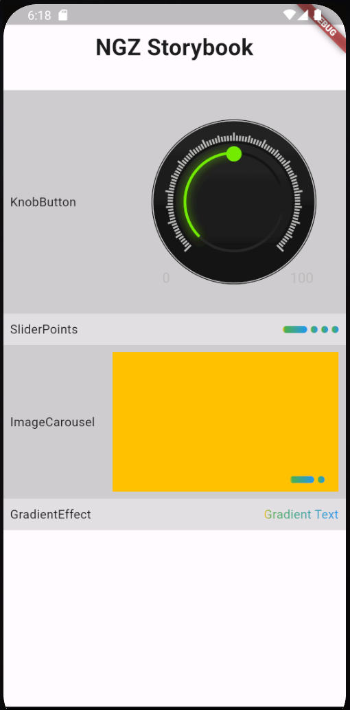

## Features

Repository containing Flutter widgets.

- Knob Button
- SliderPoints
- ImageCarousel
- GradientEffect



## Usage

Add this repo as dependency on `pubspec.yaml`

e.g: 

```
  ngz_flutter_ui:
    git:
        url: https://github.com/anoguez/ngz_flutter_ui.git
        ref: 0.0.2 # tag from release
```